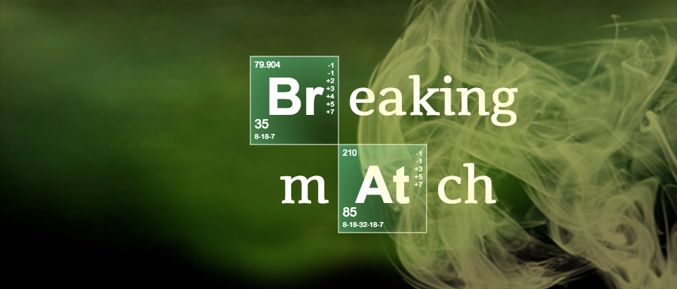

## BREAKING MATCH
This is [Match-match game](https://en.wikipedia.org/wiki/Concentration_(game)) based on the [Breaking bad](https://en.wikipedia.org/wiki/Breaking_Bad) movie.

## Demo
[Link](https://d-lobanov-breaking-match.glitch.me/)

## Technical information
The game is written in pure JS (ES6).

To run it locally use any http server, for example `php -S localhost:8000` or `python -m SimpleHTTPServer 8000`.

## Features
The script saves game and your settings after every change. That means that you can close and restore a tab or reload a page and you won't lose your data.
